# Introducción a Grafos.

1. [Introduccion](#1.-Introduccion)
    - [Relacion entre Listas - Grafos y Arboles]()
2. [Representacion de Grafos](#2.-representacion-de-grafos)
    - [Adjacency Matrix]()
    - [Adjancency List]()
3. [Big 0](#3.-Big-0)
     - [Operaciones sobre un Grafo]()
4. [Operaciones sobre Grafos](#4.-operaciones-sobre-grafos)
    [Add Vertix o Nodo]()


# 1. Introducción.

Un grafo está compuesto por __Nodos__ (Vertice) y __Conecciones__ o (Edges).
En los grafos los Nodos o Vertices están conectados por __Edges__.
Podemos ir de un nodo a otro si están conectados o pasando por nodos intermedios.
Tambien los edges pueden tenes __pesos__ o weights que hacen que quizas un camnino directo sea mas costoso.

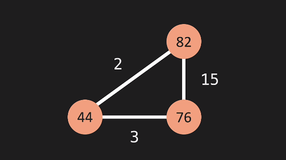

En este ejemplo los __nodos__ son 76, 44 y 82 y están conectados por __edges__.

¿Cómo llegar del Nodo 76 al 82?

si no tuvieran pesos el mejor camnino seria en forma ascendente del nodo 76 al 82, ya uqe nos evitariamos pasar por el intermedio 44.
Pero como tienen pesos, vemos que el __edge__ que conecta cambos nodos es mas pesado que si pasamos por el intermedio 44.
Un camino cuesta 15 y el otro 5. Elegimos el menos costoso.

__Un ejemplo de esta aplicacion es un mapa o una network__

__Facebook vs Instagram__

En Facebook tenemos relaciones __BIDIRECTIONAL__, donde yo soy amigo de __X__ y __X__ es amigo mio.

Pero en Instagram las relaciones son distintas, Yo sigo una cuenta pero esa cuenta no necesariamenete me sigue. Relacion en un solo sentido. __DIRECTIONAL__

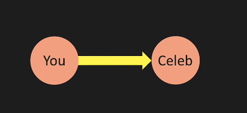


## Relacion entre Listas, Arboles y Grafos.

Los arboles son una forma de Grafos pero tienen la limitación que un Nodo solo puede apuntar a otros Nodos.

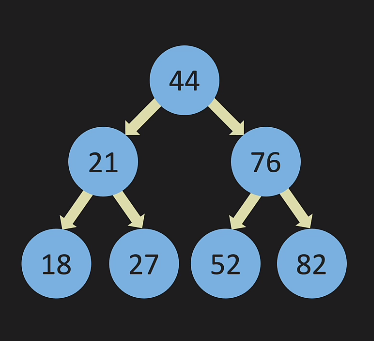

Y cuando vemos un arbol lo podemos ver como una __lista Linkeada__ que es una forma de arbol.

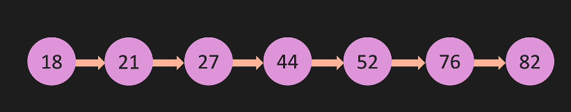

Entonces tambien lo podemos pensar como que:

__Una Linked List__ es una forma de __arbol__ y un arbol es una forma de __grafo__

 por inferencia:

Una __Linked List__ es una forma de __grafo__ con la limitacion que solo puede apuntar a un __Nodo__


## 2. Representacion de grafos

### Matriz adyacente.

La matriz es una forma de representar las relaciones entre __Nodos__
En las columnas vemos los nodos que tienen relacion con las filas.

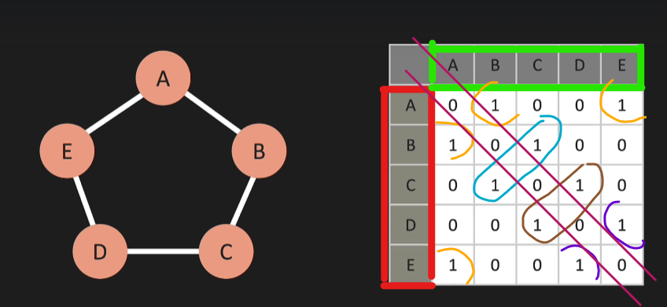

Si la relación entre los grafos es __Bidireccional__ optenemos una matriz simétrica. Donde en el centro obtenemos una linea de 45 grados que separa las dos mitades perfectamente simetricas.

Tambien podemos tener pesos en lso __Edges__ y la matriz tendria estos valores.

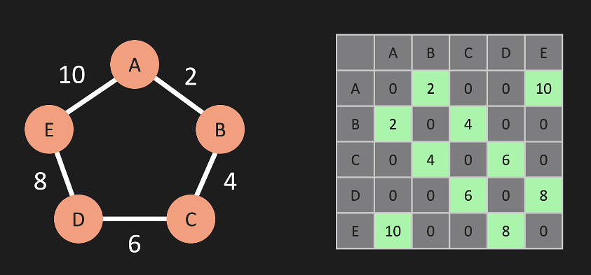


__Importante__ Lo que tiene 0 es porque no se relaciona, por ejemplo A no tiene realcion con A.


### Lista Adyacente

Es otra forma de representar las relaciones entre nodos de un grafo. Usamos listas dentro de un Diccionario.
Donde las __keys__ del diccionario son los dos de donde parte la relacion y los __value__ es una lista que contiene los Nodos con los que se relaciona.


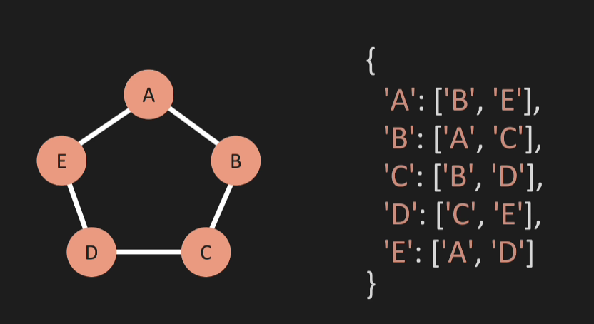

## 3. Big 0

Analizamos Big 0, tanto para la matriz de adyacencia como para la lista de Adyacencia.

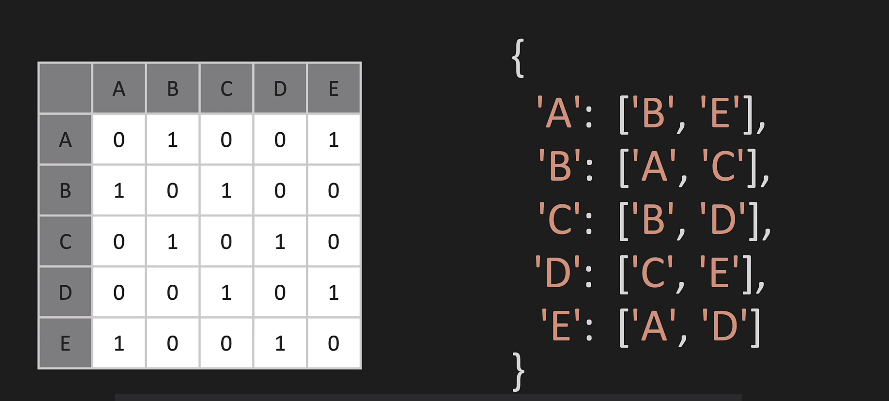

### Complejidad espacial

1. Una gran diferencia para la representacion de las relaciones, es que la __matriz de adyacencia__ se amancenan los nodos que no están relacionados, mientras que en la __lista de adyacencia__ se almacena solo lo que si está relacionado.

|Enfoque|big 0|
|-------|-----|
|Matriz de Adyacencia|0(mod(V)^2)|
|Lista de Adyacencia|0(mod(V) + mod(E))|


Donde V es el numero de vertices o __Nodos__ y E es el numero de __Edges__

### Operaciones sobre Grafos.

1. Adding a __Node__

Cuando agregamos un nuevo Nodo o Vertice lo hacemos sin ningún __Edge__ sobre una lista es sencillo porque solo estamos agregando una nueva __Key__ pero en una matriz de adyacencia es mas complejo porque debemos marcar con 0 todas las conexiones.

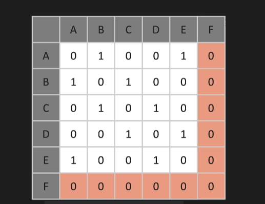

|Enfoque|Operacion|big 0|
|-------|---------|-----|
|Matriz de Adyacencia|add Node|0(mod(V)^2)|
|Lista de Adyacencia|add Node|0(1)|


2. Add Edge.

Al Nodo anterior ahora lo vamos a conectar a otros nodos por medio de un __Edge__


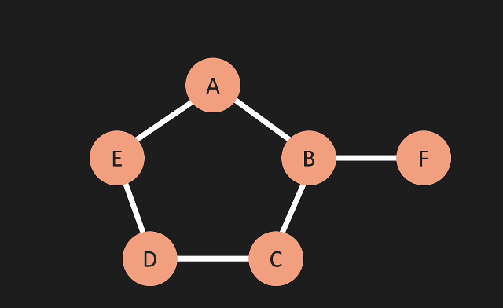

Agregar un __Edge__ a un nodo ya creado es una operacion de __.append()__ sobre la lista o de cambiar un __0 por un 1__ en la matriz. Por lo tanto donde dos operaciones 0(1)

|Enfoque|Operacion|big 0|
|-------|---------|-----|
|Matriz de Adyacencia|add Edge|0(1)|
|Lista de Adyacencia|add Edge|0(1)|

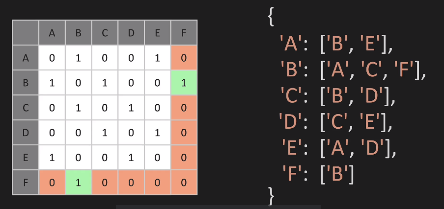


3. Delete Egde.

Para eliminar es un poco mas complejo. Eliminamos la relación entre __B__ y __F__ .

Sobre una __Lista de Adyacencia__ primero buscamos la clave (B) __KEY B__ y sobre esa clave iteramos hasta encontrar el  __valor de F__.

Sobre una matriz es mas fácil porque simplemente buscamos los valores con 1 y los convertimos en 0, __pero en la lista hay que iterar__ y esta iteracion es un loop que pedenderá de la cantidad de __Edges__


|Enfoque|Operacion|big 0|
|-------|---------|-----|
|Matriz de Adyacencia|Delete Edge|0(1)|
|Lista de Adyacencia|Delete Edge|0(mod(E))|

4. Detele Node

Para eliminar el __Nodo__ F debemos reescribir toda la matriz eliminando todos los registros de las columnas F y las Filas F.
EN cambio en la lista, solo eliminamos la Clave.

|Enfoque|Operacion|big 0|
|-------|---------|-----|
|Matriz de Adyacencia|Delete Node|0(mod(V)^2)|
|Lista de Adyacencia|Delete Node|0(mod(V) + mod(E))|


### Analisis de Facbook sobre Matrices y Listas.

Si tenemos que elegir que enfoque usar para representar un __Grafo__ de Facebook debemos tener en cuenta que si Facebook tiene 1000 millones de usuarios, debemos repesentar todos esos 0 aunque nosotros solo tengamos 130 amigos. Lo cual hace que este enfoque para facebook sea ineficiente, en cambio usar una __Lista de adyacencia__ es mas eficiente porque para cada __Key__ solo incluimos las coincidencias.

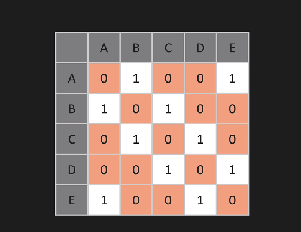

## 4. Operaciones sobre grafos

### 4.1 Add vertex.

Primero iniciamos un constructor creando un __Nodo__ que no tiene conexiones. Esto es un diccionario vacio.


```python
class Graph:
    def __init__(self):
        self.adj_list = {}

    def add_vertix(self, vertix):
        if vertix not in self.adj_list.keys():
            self.adj_list[vertix] = []
            return True
        return False

    def print_graph(self):
        for vertix in self.adj_list:
            print(key, ' : ', self.adj_list[vertix])
```

### 4.2 Add Edge.

Para poder crear un __Edge__ debemos tener al menos dos __Nodos__ o Vertices.
Para crear esta conexión debemos pasar por parametro los dos vertices que queremos conectar.

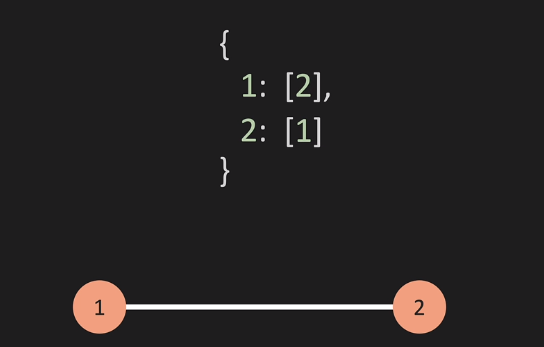

```python
def add_edge(self, v1, v2):
    if v1 in self.adj_list.keys() and v2 in self.adj_list.keys():
        self.adj_list[v1].append(v2)
        self.adj_list[v2].append(v1)
        return True
    return False
```

__Donde V1 y V2 son los vertices que queremos conectar__


### 4.3 Remove Edge

Remover o eliminar un __Edge__ es quitar la relación o conexión que existe entre dos __Nodos__
Para estos pasamos los vertices que queremos dejar de relacionar.
1. Controlamos que existan.
2. Controlamos que estén relacionados.
3. Eliminamos la relación.

En este ejemplo vamos a eleiminar la conexion que existe entre los __nodos A y B__

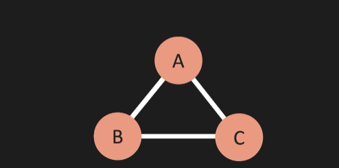


```python
def remove_edge(self, v1, v2):
    if v1 in self.adj_list.keys() and v2 in self.adj_list.keys():
        try:
            self.adj_list[v1].remove(v2)
            self.adj_list[v2].remove(v1)
        except ValueError:
            pass
        return True        
    return False
```

Para controlar que estamos eliminado algo que existe usamos un bloque __try__ __catch__ y __ValueError__

### 4.4 Remove Vertex

Para remover un __vertex__ primero debemos eliminar todas las _conexiones__ que llegan a ese __vertex__

En este ejemplo queremos remover el __vertice__ D pero antes debemos remover todos sus __Edges__

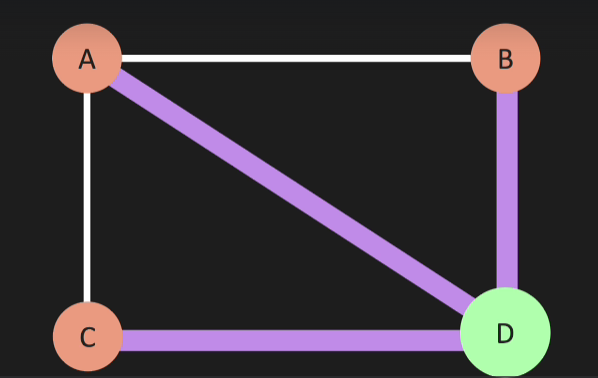


En este caso vemos que se trata de un __Grafico__ bidireccional, porque lo que todos sus __Edges__ tienen al menos un relacion.
Podemos usar un optimizador para eliminar los __Edges__ que se relacionan con __D__ de una forma mas rápida.

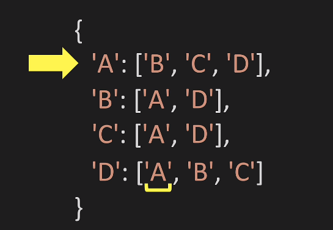

Vemos que todos los __Edges__ del __Vertex__ D existen. Entonces lo que vamos a hacer es:
1. Traer en un primer Loop todos los edges de D
2. Loopear esos Edges como si fueran claves y eliminar el __Edge__ D de cada uno.
3. Finalmente eliminamos el vertice.

```python
def remove_vertex(self, vertex):
    if vertex in self.adj_list.keys():
        for otherVertex in self.adj_list[vertex]:
            self.adj_list[otherVertex].remove(vertex)
        del self.adjlist[vertex]
        return True
    return False
```


