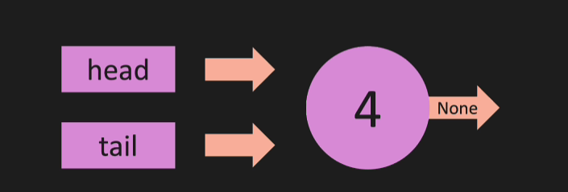
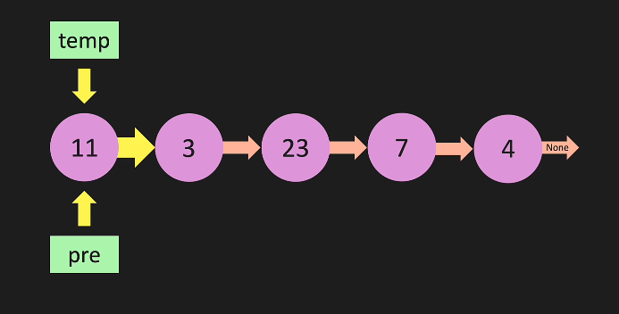

# DataStructures & Algorithms

1. [Introduccion](#1.-Introduccion)
    - [Big 0 - 0(n)]()
    - [Big 0 - 0(n^2)]()
    - [Big 0 - 0(1)]()
    - [Big 0 - 0(log n)]()
    - [Input Terms]()
    - [Resumen]()
2. [Python OOP](#2.-python-oop)
    - [introduccion]()
    - [pointers]()
3. [LInkedList](#3.-linked-list)
    - [Introduccion]()
    - [Link List y Big 0]()
    - [Nodos y LinkedList]()
    - [Constructor]()
    - [append]()
    - [pop]()
    - [prepend]()
    - [pop first]()
    - [get]()
    - [Explicacion mejorada de append]()


## 1. Introduccion

__Big 0__ Es una forma de comparar dos codigos, para determinar que tan eficientes son al momento de ejecutar.


Por ejemplo. Si tenemos __codigo 1__ y __codigo 2__. El primero ejecuta en 15'' y el segundo en 4'. Podemos decir que el primero es mas eficiente en tiempo. A esto se llama __time complexity__. 

### Time Complexity.

Lo interesante de _time complexity_ es que no se mide en tiempo porque si el codigo 1 ejecuta en una computadora 4 veces más rápida que el codigo 2, la métrica estaría distorsionada.
Se mide en el _numero de operaciones_ que necesita para completar algo.
__La mayor parte del tiempo vamos a usar time complexity__

### Space Complexity


Otra medida es __Space Complexity__, Si lo que nos interesa es el __correcto uso de la memoria__ entonces nos fijamos que algoritmo hace menos uso de la misma sin importar el tiempo que demora.
Quizás el codigo 1 demora 15'' pero usa el 75% de la memoria mientras que el codigo 2 demora 4' pero usa el 1%. Si lo que buscamos es __Space complexity__ gana el codigo 2.


### El peor escenario.

Ejemplo

|letra|letra griega|uso|ascii|
|-----|------------|---|-----|
|omega|h|Es para representar el mejor caso posible|alt + 937|
|theta|h|Es para representar el caso que no es ni el mejor ni el peor.|alt + 920|
|omicron|h|Es el peor caso de todos - es el llamado big 0|alt + 927|

__uso__

Tenemos una lista con 7 elementos y hacemos un algoritmo de búsqueda.


|1|2|3|4|5|6|7|
|-|-|-|-|-|-|-|

En el mejor escenario buscamos el número 1, que es el primer elemento y lo encontramos en __una operacion__ en cambio el peor escenario es buscar el numero 7 que lo encontramos en __7 operaciones__

|letra|numero|
|-----|------|
|omega|1|
|theta|4|
|omicron|7|

__Cuando hablamos de Big 0 no existe un mejor caso o caso intermedio, siempre estamos hablando del peor caso__

### big 0 - 0(n)

Es el caso mas sencillo. Tenemos 0(n) cuando tenemos una funcion que ejecuta n operaciones. POr ejemplo un __for loop__.

```python
def ejecuta_funcion(n):
    for i in range(n):
        print(n)
```

En este ejemplo pasamos n que será el numero de iteraciones para mostrar el __print()__

Graficamente es una linea recta o __porporcional__ donde la cantidad de operaciones aumenta proporcionalmente al numero __n__

.png)

### ¿Cómo podemos simplicar nuestra big 0?

1. El primer método se llama __drop constants__

Tenemos el mismo ejemplo anterior pero esta vez con dos __for loop__

```python
def ejecuta_funcion(n):
    for i in range(n):
        print(i)

    for j in range(n):
        print(j)
```

Estas operaciones se van a ejecutar 20 veces y por intuicion podemos escribir

__0(2n)__ porque tenemos dos __for loop__ para simplificarlo __eliminamos la constante__ y queda __0(n)__.

### Big 0 - 0(n^2)

Tenemos un __for loop anidado__. 

Ejemplo:

A la funcion anterior le pasamos __n__ pero los __for loops__ estarán uno dentro del otro.

```python
def ejecuta_funcion(n):
    for i in range(i):
        for j in range(j):
            print(i,j)
```

Este código se __ejecuta 100 veces si n = 100__ ya que una fila (i) queda fija mientras que la otra (j) itera de 0 a n.
Podemos deducir que es __n * n__ o __n^2__

En el gráfico vemos que es __menos eficiente que 0(n)__ porque para menos valores realiza mas operaciones.

.png)


### ¿Cómo podemos simplificar big 0?

2. Otro ejemplo para simplificar Big 0 es con la técnica __drop Non-Dominants__.

Ejemplo, Siguiente la funcion anterior, agregamos un __for loop__ por fuera del __loop anidado__

```python
def ejecuta_funcion(n):
    for i in range(n):
        for j in range(n)
        print(i,j)

    ##luego

    for z in range(n):
        print(z)        
```

En el caso que __n=10__, primero realiza 100 operaciones para mostrar la combinacion __(i,j)__ y luego otras 10 para mostrar __(z)__ entonces podemos deducir que __big 0__ quedaria así:

__0(n^2 + n)__ pero si lo pensamos bien, no importa que tan grande sea __n__ siempre será __muy inferior__ a __n^2__ por lo que no afectaría al resultado.
Entonces como __n__ no es el termino dominante, __lo sacamos__ y la notación queda:

__0(n^2)__

### Big 0 - 0(1)

Es la más eficiente big 0. A medida que incrementamos __n__ aumenta el número de operaciones.

Por ejemplo:

```python
def ejecuta_funcion(n):
    return n + n
```

En este ejemplo no importa que tan grande sea __n__ siempre será una única operación la que se ejecute haciendo que __big 0__ sea __0(1)__

Aún sin hacemos:

```python
return n + n +n
```
podemos suponer que __Big 0__ sería __0(2)__ pero por simplificación queda __0(1)__

Graficamente vemos que:

.png)

A medida que aumentamos __n__ la cantidad de operaciones permanece __lineal__.


### Big 0 - 0(log n)

Es el segundo tipo de algoritmos más eficiente. Casi tanto como el __lineal 0(1)__.

Ejemplo:

Tenemos una una lista con 8 elementos y buscamos el valor 1.

|1|2|3|4|5|6|7|8|
|-|-|-|-|-|-|-|-|

Recordando que __big 0__ es el peor de los casos posibles si hacemos una búsqueda lineal necesitariamos __8 operaciones__ o __o(n)__ pero podemos aplicar un algoritmo de busqueda y partir a la mitad la lista.

1. Primera iteracion. Partimos a la mitad

|1|2|3|4|
|-|-|-|-|

2. Segunda iteracion. Patrimos a la mitad

|1|2|
|-|-|

3. Tercer iteracion. Partimos a la mitar

|1|
|-|

Despues de tres iteraciones partiendo a la mitad la lista encontramos el valor 1.

__Explicacion__

Dijimos que partimos a la mitad __dividimos por 2__ y el total de elementos en la lista es __8__, entonces:

__2^x=8__ ¿Qué valor puede ser __x__?

__x = 3__ entonces tenemos

__2^3 = 8__ lo que es lo mismo a tener __log (en base 2) de 8 = 3__

En este ejemplo vemos que para encontrar un número __x__ en una lista de __8 elementos__ necesitamos 3 operaciones, pero si tuvieramos una lista de __1073741824 elementos, mas de un billón__ si la búsqueda fuera lineas necesitariamos la misma cantidad de operaciones que elementos __en el peor de los casos__ pero si usamos el algoritmo de buscar dividiendo por dos seria:

__2^x=1073741824__ esto es igual a 31. 

Solo necesitariamos 31 operaciones para encontrar un numero x.

Graficamente se ve así.

.png)

Bastante parecido y eficiente a 0(1) para valores muy grandes.

__Hasta acá estos cuatro Big 0__ son los mas usados, pero hay otro que se usa principalmente con algunos algortimos de Ordenamiento __0(n * log n)__ (Merge Sort o Quick Sort) es lo mas eficiente que podremos conseguir en un algoritmo de ordenamiento.


## Different terms of Inputs

Hasta ahora trabajamos con un solo input en nuestras funciones, pero ¿Qué pasaria si a la funcion le pasamos a y b?

```python
def ejecuta_funcion(a,b):
    for i in range(a):
        print(i)

    for j in range(b):
        print(j)
```

Cuando teniamos solo un parametro big 0 quedaba como __0(2n)__ y por simplificacion __0(n)__.
Pero ahora tenemos a y b, entonces podemos pensar que quedaria __0(2n)__ pero esto no es correcto porque a y b seguramente no seran iguales, entonces deberia ser: __0(a) + 0(b)__ o __0(a+b)__


Analogamente si tuvieramos dos __for loop__ anidados seria __0(a*b)__

## Big 0 of Lists

Hacemos un analisis sobre __Big 0 en Listas__

Tenemos una lista de ejemplo con 4 elementos y sus respectivos indices.

|11|3|13|7|
|--|-|--|-|
|0|1|2|3|

Sobre la lista podemos hacer varias acciones.

1. __append()__

Esta es una operación muy simple, no hay ningún re-indexado de datos o busqueda. Directamente insertamos al final de la lista el valor que queremos.
Como es una operación directa es __0(1)__

```python
my_list.append(17)
```


|11|3|13|7|17|
|--|-|--|-|--|
|0|1|2|3|4|

2. __pop()__

Al igual que append(), __pop()__ no requiere de busqueda o re-indexado de datos. Directamente elimina el último elemento de la lista.
Tambien tiene un Big 0 __0(1)__

```python
my_list.pop()
```

### ¿Qué pasa cuando queremos eliminar o insertar un valor en un indice determinado?

3. __pop(n)__

Cuando hacemos __my_list.pop(n)__ estamos eliminando el registro en el indice __n__ pero a la vez debemos reorganizar los indices restantes.


4. __.insert(0,11)__

En este ejemplo insertamos en el indice 0 el elemento 11. Ocurre lo mismo que con __.pop(n)__ debemos reorganizar los indices.

Tanto para 3 y 4 el __big 0 es 0(n)__ donde n es el numero de elementos de la lista.

5. ¿Qué pasa si queremos insertar algo en la mitad de la lista?

En este caso deberiamos reorganizar la mitad de los indices, pero __big 0__ no es __0(1/2 n)__ poruqe Big 0 mide el peor de los casos, no un caso intermedio y ademas eliminamos la constante, asique queda __0(n)__

### ¿Diferencia entre buscar un valor y buscar por índice?

Si de la lista buscamos el valor 7 sin saber su indice es una operacion __0(n)__ porque tendremos que iterar por toda la lista hasta encontrar el valor.
Pero si buscamos por indice es una operacion __0(1)__ porque solo accedemos una vez independientemente del tamañano de la lista.


## Resumen

Analisis de un caso cuando __n = 100__

|big 0|n=100|n=1000|descripcion|
|-----|-----|------|
|0(1)|1|1|constante|
|0(log n)|7|10|divide and conquer|
|0(n)|100|1000|proporcional|
|0(n^2)|10000|1000000|loop dentro de un loop|

En este ejemplo vemos que __0(1)__ no aumenta independientemente de n y __0(log n)__ apenas pasa de 7 a 10 cuando n va de 100 a 1000.
El peor escenario es __0(n^2)__ ya que su crecimiento es exponencial.

[Recurso - cheat sheet](https://www.bigocheatsheet.com/)


## 2. Python OOP

### Introducción

1. ¿Qué es una clase?

Una clase es un __blue print__ o plantilla para crear objetos.

```python
class Cookie:
    def __init__(self, color):
        self.color = color

    def get_color(slef):
        return self.color

    def set_color(self, color):
        self.color = color
```

donde:
- __ __init__ __ es un constructor. 
- __self__ es la sentencia que hace referencia al objeto de forma univoca.
- __get_color__ y __set_color__ son dos metodos.

2. Ejemplo con __LinkedList__

```python
class LinkedList:
    def __init__(self, value):
        pass
        
    def append(self, value):
        pass
        
    def pop(self):
        pass
        
    def prepend(self, value):
        pass
        
    def insert(self, index, value):
        pass
        
    def remove(self, index):
        pass
```

### Pointers

- Los punteros funcionan de forma distinta según el tipo de dato.

```python
num1 = 11
num2 = num1

print("Numero 1 {}".format(num1))
print("Numero 2 {}".format(num2))

print("Numero 1 points to  {}".format(id(num1)))
print("Numero 2 points to {}".format(id(num2)))
```

```
Cuando asignamos un valor a una variable lo que hacemos es reservar una porcion de memoria que apunta a ese valor.
Y si asignamos esa variable __num1__ a __num2__ ambas apuntarán a la misma posicion de mememoria.
En el ejemplo anterior ambdas variables apuntan a la misma dirección de memoria.
```

- ¿Qué pasa si modificamos __num2__?

```python
num2 = 22

print("Numero 1 {}".format(num1))
print("Numero 2 {}".format(num2))

print("Numero 1 points to  {}".format(id(num1)))
print("Numero 2 points to {}".format(id(num2)))
```

```
Vemos que el valor y la direcccion a la que apunta num1 permanece igual pero num2 cambia tanto el valor como la dirección a la que apunta.
```
El motivo de esto es que __lo integers__ son un tipo de dato __inmutable__ los mismos no se pueden cambiar una vez creados.

__¿Qué pasaria si cambiamos num1 = 22?__

Si hacemos este cambio tanto __num2__ como __num1__ tendrian el valor 22 y apuntarian a la misma posición de memoria.
Esto es así porque __internamente python crea una posición de memoria exclusiva para el numero 22__


- ¿Qué pasa con los diccionarios?

```python
dict1 = {
    'value': 22
        }

dict2 = dict1

print("El diccionario dict1 apunta a {}".format(id(dict1)))
print("El diccionario dict2 apunta a {}".format(id(dict2)))
```

```
En ambos casos los diccionarios apuntan a la misma posición de memoria.
```

```python
dict2['value'] = 133

print("Ev valor de diccionario1 es {}".format(dict1))
print("Ev valor de diccionario2 es {}".format(dict2))

print("El diccionario dict1 apunta a {}".format(id(dict1)))
print("El diccionario dict2 apunta a {}".format(id(dict2)))
```

Pero si cambiamos el valor de uno de los diccionarios, vemos que no cambian la dirección a la que apuntan.
Esto es así porque los __diccionarios son mutables__

__IMPORTANTE__ ¿Qué pasa si ahroa asignamos la variable dict1 a otro disccionario?

```python
dict3 = {'value' : 44}
dict1 = dict3
```

¿Qué pasó con la posición de memoria que tenia el diccionario __{'value': 22}__?

```
Debido a que ya no tenemos una variable o posición de memoria que apunte a ese diccionario, en este momento se ejecuta el "garbage collector" para liberar ese sector.
```

## 3. Linked List

### Introducción.

Para estudiar __Linked List__ vamos a compararlo contra las __listas en python__
Una lista tiene __indices__ y los datos están contiguos en posiciones de memoria. Para acceder a los datos el __time complexity__ es de __0(1)__ porque tenemos el indice.

Pero en las __Linked List__ las listas o los valores no tienen indices y las posiciones de memoria no necesariamente son contiuas.
Lo que tenemos en este caso son __nodos__ que tienen un puntero al siguiente y el último __tail__ apunta a __None__. Este punturo nos permite recuperar los nodos en el orden correcto. El primer nodo es __head__

Linked List vs List
-------------------


### 1. Linked List y Big 0.

Analizamos cual será el __Big 0__ para cada método que podemos aplicar sobre las __Linked List__

1. __append__ al final de la lista.

En este método insertamos al final de la lista un nuevo __nodo__ por lo tanto lo que hacemos es:
- Al nodo final le agregamos le puntero a la nueva __tail__
- La nueva __tail__ apunta a __None__


Agregamos el __nodo 4__ que será la nueva __tail__

__Big 0__ __0(1)__ no importa la cantidad de elementos, porque ya sabemos cual es la __tail__, no tenemos que buscar nada.

2. __remove__ al final de la lista.

Aplicar remove desde __tail__ es más complicado, porque debemos mover el punto __tail__ uno hacia atras, pero esto no se puede hacer.
Debemos recorrer la __Linked List__ para encontrar el __nuevo ultimo elemento__ desd el comienzo.


En esta imagen elminamos el __nodo 4__ y el __nodo 7 vuelve a ser la tail__

__Big 0__ __0(n)__ porque debemos iterar desde el comienzo para encontrar el ultimo elemento para que apunte a __None__

3. __prepend__ Agregar al comienzo de la lista.

Agregamos un nuevo nodo al comienzo de la __Linked List__ haciendo que este nuevo nodo se combierta en la __head__ y apunte a la __head anterior__


En esta imagen agregamos el __nodo 4__ a la cabecera haciendo que ahora apunte a __nodo 11__ 

 __Big 0__ __0(1)__ En este método no importa la cantidad de elementos en la lista.


 4. __remove__ la cabecera.

 En este método eliminamos la __head__ de la lista, haciendo que a lo que apunta __head__ sea la nueva cabecera.


En esta imagen removemos el nodo __head__ __nodo 4__ y el __nodo 11__ vuelve a ser la cabecera.

 __Big 0__ __0(1)__ no importa la cantidad de elementos, sabemos donde está __head__ y no necesitamos iterar.


5. __insert__ en la mitad

Queremos insertar el __nodo 4__ despues del __nodo 23__ y que apunte a __nodo 7__
Tenemos que iterar por la lista hasta llegar al __nodo 23__, cambiamos el puntero del __nodo 23__ al __nodo 4__, este ahora apunta al __nodo 7__ y el __nodo 23__ apunta al __nodo 4__


__Big 0__ __0(n)__ como debemos iterar por la listas la complejidad depende de la cantidad de elementos.

6. __remove__ un nodo especifico.

Para eliminar el __nodo 4__ insertado anteriormente o desde una posicion x de la lista, debemos iterar desde el __head__ hasta el __nodo 4__ el puntero de este nodo pasa al __nodo 23__ que ahora apunta al __nodo 7__.


Despues de remover el __nodo 4__ el mismo ya no apunta a nada y se elimina.

__Big 0__ __0(n)__ debido a que tuvimos que iterar desde __head__ para llegar al __nodo 4__ la complejidad depende de la cantidad de nodos.

7. __lookup__ de un nodo x

Para buscar un nodo x iteramos desde el __head__ hasta llegar al que buscamos.
En las __Linked List__ las busquedas empiezan por __head__ y __time complexity__ depende de la cantidad de elementos.
A diferencia de las __Listas__ donde al conocer el __indice__ el esfuerzo es __constante o 0(1)__

__Big 0 0(n)__ depende proporcionalmente de la cantidad de nodos.


8. Comparacion de __Big 0__ entre __Linked List y List__

|metodo|Linked List|List|mejor o peor|
|------|-----------|----|------------|
|append|0(1)|0(1)|ambos|
|pop|0(n)|0(1)|List|
|prepend|0(1)|0(n)|Linked List
|pop first|0(1)|0(n)|Linked List
|insert|0(n)|0(n)|ambos
|remove|0(n)|0(n)|ambos
|Lookup by index|0(n)|0(1)|List
|lookup by value|0(n)|0(n)|ambos

### 1. Nodos y Linked List

Para entender bien como funcionan las __Linked List__ hay que entender como están formados los __nodos__


En este ejemplo cada nodo se lo puede ver como un diccionario (key, val)

```python
nodo4 = {
            'value': 4,
            'next': None
        }
```

- __¿Pero como llegamos al nodo 23 nodo desde head?__

```python
head = {
        "value":11,
        "next":{
                "value":3,
                "next":{
                        "value":23,
                        "next":{
                                "value":7,
                                "next":{
                                        "value":4,
                                        "next":None
                                        }
                                }
                        }
                }
        }

head.next.next.value
#23
```

### 3. Constructor de Linked List

Implementamos nuestro constructor para crear __Linked List__

```python
class LinkedList:
    def __init__(self, value):
        # create a new node
        self.value = value

    def append(self, value):
        # create a new node
        pass

    def prepend(self, value):
        # create a new node
        pass

    def insert(self, index, value):
        # create a new node
        pass
```

Dentro de este constructor podemos agregar tres métodos.
1. append(self, value)
2. prepend(self, value)
3. insert(self, insert, value)

Estos tres tienen en comun que crean un nuevo nodo, asique no tiene sentido crear tres métododos que vas a hacer los mismo. __Por lo tanto creamos una clase que solo crea nodos__
Esta clase nodo solo contendrá un constructor.

__Entonces la clase nos quedaria asi__

```python
class Node:
    def __init__(self, value):
        self.value = value
        self.next = None

class LinkedList:
    def __init__(self, value):
        new_node = Node(value)
        self.head = new_node
        self.tail = new_node
        self.lenght = 1

if __name__ == '__main__':
    my_linked_list = LinkedList(4)
```
En este ejemplo se crea una instancia (Objeto) de la clase Linked List con un solo Nodo. La particularidad del primer nodo es que __head__ y __tail__ apuntan al __unico nodo__ y este  apunta a __None__




__Método para graficar o imprimir una Linked List__

```python
def print_list(self):
    temp = self.head
    while temp is not None:
        print(temp.value)
        temp = temp.next
```

### 3.1 Método Append para Linked List

Creamos el método para insertar un nodo __al final__ de la lista. UN caso especial es cuando la lista está vacia y tanto __head__ como __tail__ apuntan a __None__ en ese caso el método __append__ crea el nodo.

```python
def append(self, value):
    new_node = Node(value)
    if self.lenght = 0:
        self.head = new_node
        self.tail = new_node
    else:
        self.tail.next = new_node
        self.tail = new_node
    self.lenght +=1

    return True
```

Si ejecutamos el siguiente codígo, tendriamos el diccionario:

```python
my_linked_list = LinkedList(4)
my_linked_list.append(25)
```

```python
head = {
            'value':4,
            'next': {
                        'value':25,
                        'next':None
                    }
            }
```

__Porqué estamos haciendo esto?__

```
self.tail.next = new_node
        self.tail = new_node
```

A simple vista parece que estamos sobre-escribiendo __tail__ con un nuevo valor y lo perdemos y despues volvemos a escribir __new_node__ en __tail__, pero porque?

- Lo primero que hay que tener en cuenta es que tail y head no son variables, son propiedades y no lo estamos sobre-escribiendo. Lo que estamos haciendo es decirle al __último nodo__ en su diccionario que el __valor next__ ahora será el nuevo nodo. 
Esto lo que hace es que __lo que antes era tail__ ahora es un nodo mas, que en __next__ apunta al nuevo __tail__ y este __tail__ al asiganarle __new_node__ no apunta a nada, porque cuando creamos un nuevo nodo __next:None__


### Ejemplo con diccionarios:


En este ejemplo tenemos que __tail__ es 7 y su __next__ es __None__
Todo esto que vemos es un objeto __LInkedList__
Lo que queremos hacer es insertar __nodo 4 al final__

```python
head = {
            'value': 11,
            'next': {
                        'value': 3,
                        'next': {
                                    'value': 23,
                                    'next': {
                                                'value':7,
                                                'next':None
                                            }
                                }
                    }
        }
```

1. Al actual __tail__ se asignamos __next__ el nuevo nodo.
Lo que va a pasar acá es que el actual nodo tail ahora tendra un __next__
pero en el objeto __LinkedList__ serguirá siendo __tail__

```python

self.tail.next = new_node

head= {
    ....,
    'next': {
                'value':7, ## Sigue siendo el tail del objeto.
                'next':{
                            'value':4,
                            'next':None
                        }
            }
        }
```

2. Ahora movemos el __tail__ al final __al nuevo nodo__

```python
self.tail = new_node

head= {
    ....,
    'next': {
                'value':7, 
                'next':{
                            'value':4,## El nuevo tail  del objeto.
                            'next':None
                        }
            }
        }
```

__Es importante recordar que head y tail__ no son variables son propiedades de la clase. 

- __¿Porqué a medida que vamos agregando nodos al _tail_ los nodos intermedios no desaparecen?__

Cuando agregamos nuevos nodos al __tail__ con el __método append__ indirectamente tambien estamos guardando los nodos anteriores ya generados.

```python
self.tail.next = new_node
self.tail = new_node
```

Hay que recordar que internamente esto trabaja como si guera un diccionario entonces lo que hace es lo siguiente. 
A medida que se van insertando nodos, dentro de next se van creando otros diccionarios de esta manera:

```python
my_linked_list.head.next.next.next.value
```

Siempre partimos del __head__ y en este caso cada vez que se inserta o hace __append__ de un nuevo node, se crea un nuevo nivel __next__ hasta llegas al nuevo __tail__

### 3.2 Método pop para Linked List

Este método elimina el último nodo __tail__ de la __Linked List__ conviertiendo al ante-ultimo nodo en el nuevo nodo __tail__ con __next:None__

En este caso podemos tener dos casos que si o si hay que contemplar.
1. Listas vacias.
2. Listas con un único nodo.

Este método es mas complicado porque no podemos ir hacia atrás en una __Linked List__, asique debemos comenzar desde el principio y buscar nodo a nodo hasta encontrar el que tiene __next:None__ y quedarnos con el anterior.



Para poder llegar hasta el ante-ultimo nodo, vamos a empezar desde el __head__ con dos variables, una __temp__ y otra __pre__, esta ultima tendrá el último nodo visitado en la iteracion.
La idea es __iterar__ desde __head__ hasta __tail__ con la variable __temp__ y detenernos cuando __next:None__ ese será el último nodo pero __pre__ habrá quedado en el ante-último.

```python
def pop(self):
    if self.lenght == 0:
        return None
    temp = self.head
    pre = self.head
    
    while (temp.next):
        pre = temp
        temp = temp.next

    self.tail = pre
    self.tail.next = None

    self.lenght -=1

    # Esto es si tenemos un elemento solo, despues de haber ejecutado la parte # de arriba, lenght queda en 0
    if self.lenght == 0: 
        self.head = None
        self.tail = None
    return temp # retornamos el nodo que eliminamos.
```

### 3.3 Método prepend para Linked List

Con este método vamos a agregar un nuevo nodo al inicio de la __Linked List__
Debemos setear el __Pointer__ del nuevo nodo al __header__ anterior.

- Si no hay nodos, entonces este nodo será el primero __head__ y __tail__.
- Si hay solo un nodo el existente pasa a ser __tail__

```python
def prepend(self, value):
    new_node = Node(value)

    if self.lenght == 0:
        self.head = new_node
        self.tail = new_node
    else:
        new_node.next = self.head
        self.head = new_node
    self.lenght +=1
    return True
```

### 3.4 Método pop first para Linked List

En este caso, tenemos un nodo __head__ pero lo eliminamos y el nodo siguiente se convierte en el nuevo __head__

- Una caso especial es si tenemos un solo __Nodo__ entonces tanto __head__ como __tail__ quedan en __None__
- Otro caso especial es cuando la lista está vacia.

```python
def popfirst(self):
    if self.lenght == 0:
        return None
    else:
        temp = self.head
        self.head = self.head.next
        temp.next = None
        self.lenght -=1

    # Esto ultimo lo hacemos ya que si habia un elemento, ahora quedan 0 elementos pero el head y tail siguen apuntando a algo distinto de None
    if self.lenght == 0:
        self.head = None
        self.tail = None

    return temp
```

### 3.5 Método GET para Linked List

Vamos a pasarle un __indice__ y retornar el __nodo__ de ese incide.

- Es necesario validar que el __indice__ sea valido, ni negativo o mayor al __self.lenght__

Para esto vamos a usar un for loop.

```python
def get(self, index):
    if index < 0 or index >= self.lenght:
        return None
    
    temp = self.head
    for _ in range(index):
        temp = temp.next
    
    return temp
```
